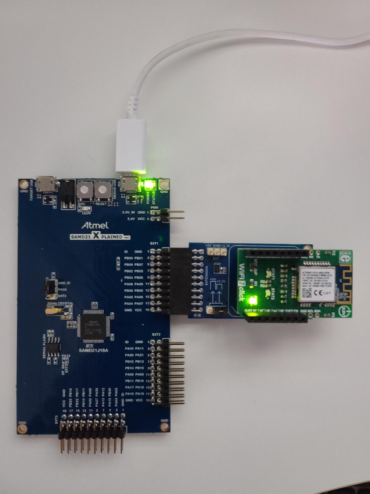
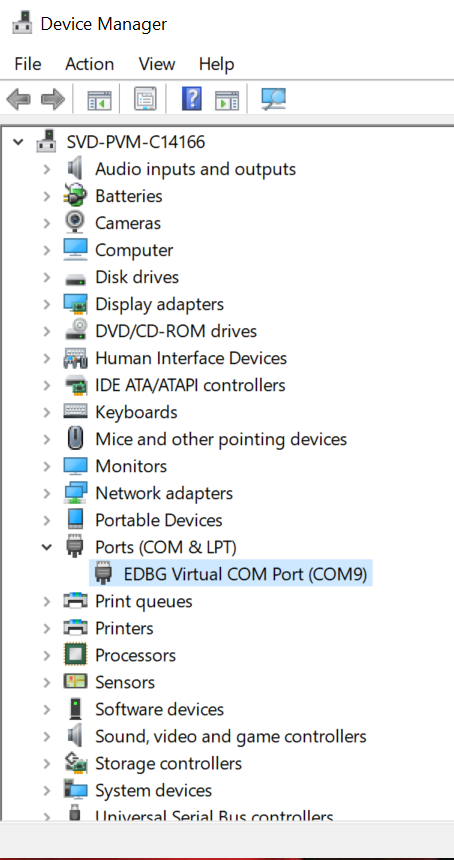

# WiFi 7 Click Board Firmware Update

## Background

The ATWINC1510 module on the WiFi7 click board needs to be updated with a minimum firmware version of 19.7.7. Most WiFi7 clicks have ATWINC1510 modules programmed with an older firmware version of 19.5.2 which will **not** work with any demos which require authenticating with and connecting to Azure IoT services.

## Software Requirements

- [Microchip Studio for AVR and SAM Devices](https://www.microchip.com/en-us/tools-resources/develop/microchip-studio)
- [MPLAB Integrated Programming Environment (IPE)](https://www.microchip.com/en-us/tools-resources/production/mplab-integrated-programming-environment)

## Hardware Requirements

The following development boards manufactured by Microchip Technology are required for updating the firmware running on the WiFi7 click board:

  1. [SAMD21 Xplained Pro Evaluation Kit](https://www.microchip.com/en-us/development-tool/atsamd21-xpro)
  2. [mikroBUS Xplained Pro](https://www.microchip.com/en-us/development-tool/ATMBUSADAPTER-XPRO)

## Hardware Setup

1. Connect USB cable to the `DEBUG USB` port of SAMD21 Xplained Pro
2. Connect the WiFi7 click to the mikroBUS Xplained Pro
3. Install jumper for the `+3.3V` setting on the mikroBUS Xplained Pro
4. Connect the mikroBUS Xplained Pro to the `EXT1` connector of the SAMD21 Xplained Pro

    

## Procedure

1. Using the [MPLAB Integrated Programming Environment (IPE)](https://www.microchip.com/en-us/tools-resources/production/mplab-integrated-programming-environment), program the provided serial bridge HEX file into the SAMD21 Xplained Pro (ATSAMD21J18A)

2. Download/clone the repo located at https://github.com/Microchip-MPLAB-Harmony/wireless_wifi

3. Press the `RESET` button on the SAMD21 Xplained Pro board.

4. Determine the Virtual COM port number associated with the USB connection of the SAMD21 Xplained Pro board. For example, you can use the Windows Device Manager to find the `EDBG Virtual COM Port` found under the `Ports (COM & LPT)` category

    

5. Launch a command line window (e.g. PowerShell or Command Prompt)

6. Navigate to the folder `\wireless_wifi\utilities\wifi\winc` (in the local clone of the repository)

7. Execute the following on the command line (e.g. <COM_PORT> = COM9):
    ```bash
    winc_flash_tool.cmd /p <COM_PORT> /d winc1500 /v 19.7.7 /e /x /i prog /w
    ```
## References

- [Wireless Apps Getting Started User Guide](https://github.com/Microchip-MPLAB-Harmony/wireless_apps_winc1500/blob/master/apps/getting_started/GUID-AE48AE71-0F91-444B-8AC3-C5C1939A37FB.md)

## Sample Output for a Successful ATWINC1510 Firmware Update

```bash
C:\Users\john5\wireless_wifi\utilities\wifi\winc>winc_flash_tool.cmd /p COM9 /d winc1500 /v 19.7.7 /e /x /i prog /w
using UART programmer on port COM9
using WINC15x0
========================================
WINC Programming Tool 2.0.1 [ceebe5f] (Apr 20 2022)
Copyright (C) Microchip Technology Inc. 2022

software WINC serial bridge found, baud rate changes supported
chip ID is 0x001503a0
programming firmware file: 19.7.7\firmware\programmer_firmware.bin
starting device
reinitialise serial bridge to 500000
waiting for firmware to run
flash ID 0x001440ef
flash size is 8 Mb
reading efuses
efuse bank 0:  0xc0000000 0x00000000 0x00000000 0x00000000
efuse bank 1:  0xc0000000 0x00000000 0x0000e0ba 0xfac00000
efuse bank 2:  0x81608a10 0xb1c92f00 0x816c0000 0x00000000 Active[XO_Off=0x016c]
efuse bank 3:  0x00000000 0x00000000 0x00000000 0x00000000
efuse bank 4:  0x00000000 0x00000000 0x00000000 0x00000000
efuse bank 5:  0x00000000 0x00000000 0x00000000 0x00000000

xo_offset is 0x016c
========================================
Device Image Creation Tool 2.0.1 [ceebe5f] (Apr 20 2022)
Copyright (C) Microchip Technology Inc. 2022

processing region '[boot firmware]'
WINCFirmwareImageBuild: opening firmware file '19.7.7/firmware/boot_firmware.bin'
written 1304 of 4096 bytes to image (32%)
processing region '[control sector]'
WINC1500ControlSectorBuild: creating control sector
written 64 of 4096 bytes to image (2%)
processing region '[backup sector]'
written 0 of 4096 bytes to image (0%)
processing region '[pll table]'
Creating WiFi channel lookup table for PLL with xo_offset = 5.6875.
written 456 of 1024 bytes to image (45%)
processing region '[gain table]'
WINC1500GainBuildV2: creating gain tables
written 1600 of 3072 bytes to image (53%)
processing region '[root certificates]'
found certificate: Amazon Root CA 1
found certificate: Baltimore CyberTrust Root
found certificate: DigiCert High Assurance EV Root CA
found certificate: DigiCert SHA2 High Assurance Server CA
found certificate: DigiCert Global Root G2
found certificate: Entrust Root Certification Authority
found certificate: GlobalSign Root CA
found certificate: ISRG Root X1
found certificate: QuoVadis Root CA 2
found certificate: VeriSign Class 3 Public Primary Certification Authority - G5
written 3572 of 4096 bytes to image (88%)
processing region '[tls certificates]'
written 0 of 8192 bytes to image (0%)
processing region '[http files]'
HTTPFileSystemAddFile: opening HTTP file '19.7.7/http_files/default.html'
HTTPFileSystemAddFile: opening HTTP file '19.7.7/http_files/style.css'
HTTPFileSystemAddFile: opening HTTP file '19.7.7/http_files/favicon.ico'
HTTPFileSystemAddFile: opening HTTP file '19.7.7/http_files/logo.png'
HTTPFileSystemAddFile: opening HTTP file '19.7.7/http_files/error.json'
HTTPFileSystemAddFile: opening HTTP file '19.7.7/http_files/scanresults.json'
HTTPFileSystemAddFile: opening HTTP file '19.7.7/http_files/ok.json'
written 7524 of 8192 bytes to image (92%)
processing region '[connection parameters]'
written 0 of 4096 bytes to image (0%)
processing region '[downloader firmware]'
WINCFirmwareImageBuild: opening firmware file '19.7.7/firmware/downloader_firmware.bin'
written 4628 of 241664 bytes to image (2%)
processing region '[wifi firmware]'
WINCFirmwareImageBuild: opening firmware file '19.7.7/firmware/wifi_firmware.bin'
written 235472 of 237036 bytes to image (100%)
processing region '[ate firmware]'
WINCFirmwareImageBuild: opening firmware file '19.7.7/firmware/burst_tx_firmware.bin'
written 77304 of 765952 bytes to image (11%)
========================================
WINC Programming Tool 2.0.1 [ceebe5f] (Apr 20 2022)
Copyright (C) Microchip Technology Inc. 2022

software WINC serial bridge found, baud rate changes supported
chip ID is 0x001503a0
programming firmware file: 19.7.7\firmware\programmer_firmware.bin
starting device
reinitialise serial bridge to 500000
waiting for firmware to run
flash ID 0x001440ef
flash size is 8 Mb

begin erase operation

0x000000:[eeeeeeee] 0x008000:[eeeeeeee] 0x010000:[eeeeeeee] 0x018000:[eeeeeeee]
0x020000:[eeeeeeee] 0x028000:[eeeeeeee] 0x030000:[eeeeeeee] 0x038000:[eeeeeeee]
0x040000:[eeeeeeee] 0x048000:[eeeeeeee] 0x050000:[eeeeeeee] 0x058000:[eeeeeeee]
0x060000:[eeeeeeee] 0x068000:[eeeeeeee] 0x070000:[eeeeeeee] 0x078000:[eeeeeeee]
0x080000:[eeeeeeee] 0x088000:[eeeeeeee] 0x090000:[eeeeeeee] 0x098000:[eeeeeeee]
0x0a0000:[eeeeeeee] 0x0a8000:[eeeeeeee] 0x0b0000:[eeeeeeee] 0x0b8000:[eeeeeeee]
0x0c0000:[eeeeeeee] 0x0c8000:[eeeeeeee] 0x0d0000:[eeeeeeee] 0x0d8000:[eeeeeeee]
0x0e0000:[eeeeeeee] 0x0e8000:[eeeeeeee] 0x0f0000:[eeeeeeee] 0x0f8000:[eeeeeeee]

begin write operation

0x000000:[ww.ww..w] 0x008000:[w.wwwwww] 0x010000:[wwwwwwww] 0x018000:[wwwwwwww]
0x020000:[wwwwwwww] 0x028000:[wwwwwwww] 0x030000:[wwwwwwww] 0x038000:[wwwwwwww]
0x040000:[wwwwwwww] 0x048000:[wwwwwwww] 0x050000:[wwwwwwww] 0x058000:[........]
0x060000:[........] 0x068000:[........] 0x070000:[........] 0x078000:[........]
0x080000:[........] 0x088000:[........] 0x090000:[........] 0x098000:[........]
0x0a0000:[........] 0x0a8000:[........] 0x0b0000:[........] 0x0b8000:[........]
0x0c0000:[........] 0x0c8000:[........] 0x0d0000:[........] 0x0d8000:[........]
0x0e0000:[........] 0x0e8000:[........] 0x0f0000:[........] 0x0f8000:[........]

begin read operation

0x000000:[rrrrrrrr] 0x008000:[rrrrrrrr] 0x010000:[rrrrrrrr] 0x018000:[rrrrrrrr]
0x020000:[rrrrrrrr] 0x028000:[rrrrrrrr] 0x030000:[rrrrrrrr] 0x038000:[rrrrrrrr]
0x040000:[rrrrrrrr] 0x048000:[rrrrrrrr] 0x050000:[rrrrrrrr] 0x058000:[rrrrrrrr]
0x060000:[rrrrrrrr] 0x068000:[rrrrrrrr] 0x070000:[rrrrrrrr] 0x078000:[rrrrrrrr]
0x080000:[rrrrrrrr] 0x088000:[rrrrrrrr] 0x090000:[rrrrrrrr] 0x098000:[rrrrrrrr]
0x0a0000:[rrrrrrrr] 0x0a8000:[rrrrrrrr] 0x0b0000:[rrrrrrrr] 0x0b8000:[rrrrrrrr]
0x0c0000:[rrrrrrrr] 0x0c8000:[rrrrrrrr] 0x0d0000:[rrrrrrrr] 0x0d8000:[rrrrrrrr]
0x0e0000:[rrrrrrrr] 0x0e8000:[rrrrrrrr] 0x0f0000:[rrrrrrrr] 0x0f8000:[rrrrrrrr]

verify range 0x000000 to 0x100000
begin verify operation

0x000000:[pp.pp..v] 0x008000:[p.vvvvvv] 0x010000:[vvvvvvvv] 0x018000:[vvvvvvvv]
0x020000:[vvvvvvvv] 0x028000:[vvvvvvvv] 0x030000:[vvvvvvvv] 0x038000:[vvvvvvvv]
0x040000:[vvvvpvvv] 0x048000:[vvvvvvvv] 0x050000:[vvvvvvvp] 0x058000:[........]
0x060000:[........] 0x068000:[........] 0x070000:[........] 0x078000:[........]
0x080000:[........] 0x088000:[........] 0x090000:[........] 0x098000:[........]
0x0a0000:[........] 0x0a8000:[........] 0x0b0000:[........] 0x0b8000:[........]
0x0c0000:[........] 0x0c8000:[........] 0x0d0000:[........] 0x0d8000:[........]
0x0e0000:[........] 0x0e8000:[........] 0x0f0000:[........] 0x0f8000:[........]

verify passed
========================================
Operation completed successfully

